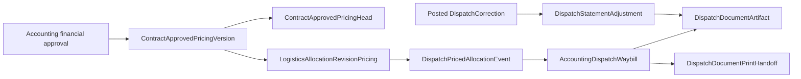

# Dispatch document persistence contract

This module freezes the shared contracts and owns dispatch-document orchestration: atomic primary bundle issuance,
immutable artifact preparation, replacement, authorized retrieval, print handoff, and the combined read model. It
does not own financial approval, Logistics pricing calculation, PDF layout, or Dispatch Correction posting.

## Ownership graph

`AccountingDispatchWaybill` remains the bundle aggregate root. A version, row, readiness result, allocation
pricing reference, priced-allocation event, adjustment, published artifact, handoff item, manifest, and migration
evidence row is immutable. The pricing head is the only mutable pricing pointer and must always point to a version
for the same contract.

## Frozen consumer ports

- Renderer input: `DispatchDocumentRenderInput`; exact quantities and amounts are canonical decimal strings.
- Artifact publisher: `DispatchArtifactPublisher`; it returns PDF bytes but does not persist them.
- Gate: `isShipmentStatementFlowActive`; both the exact-case environment opt-in and the recorded database cutover
  must be enabled. Deployment time is never treated as cutover time.
- Migration: `SHIPMENT_STATEMENT_PRESERVATION_SCOPES` and `compareMigrationEvidence` define the before/after
  manifest contract. `npm run verify:shipment-statement-migration` reads those scopes from the real database,
  runs `prisma migrate deploy`, reads them again, and persists the comparison. Repeating the command records a
  second immutable run that proves deploy idempotency.

Primary `WAYBILL` and `STATEMENT` artifacts are each unique per waybill. Adjustment artifacts require a positive,
waybill-local sequence linked one-to-one to a posted correction. Successful print handoff is represented by ordered
artifact items; failed transfer attempts retain failure evidence and do not create successful items.

A document-only replacement creates the existing successor `AccountingDispatchWaybill` aggregate and publishes a
new per-waybill artifact pair. The predecessor artifacts remain immutable history. A SHA-256 checksum verifies bytes
but is deliberately not a global document identity, so predecessor and successor records may retain equal verified
bytes without collapsing their distinct history.

Production Accounting startup installs one `dispatchDocuments` runtime with the Chromium renderer. Existing
decision, void, and replacement URLs remain the sole command surface and delegate post-cutover work into this module;
the mounted document router adds only retrieval, print-handoff, and combined-read-model URLs. Pilot Safety Pause
blocks issuance and replacement, while rejection/return may still release a pending allocation and terminal void may
still revoke an unexited authorization without creating new dispatch work.

The migration is additive and seeds only the disabled singleton cutover row. Rollback means disabling the external
feature opt-in before activation; no evidence table or row is deleted.
