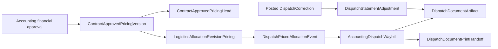

# Dispatch document persistence contract

This module freezes the shared contracts for Customer Shipment Statements. It does not orchestrate approval,
allocation, issuance, correction posting, rendering, or cutover.

## Ownership graph

`AccountingDispatchWaybill` remains the bundle aggregate root. A version, row, readiness result, allocation
pricing reference, priced-allocation event, adjustment, published artifact, handoff item, manifest, and migration
evidence row is immutable. The pricing head is the only mutable pricing pointer and must always point to a version
for the same contract.

## Frozen consumer ports

- Renderer input: `DispatchDocumentRenderInput`; exact quantities and amounts are canonical decimal strings.
- Artifact publisher: `DispatchArtifactPublisher`; it returns PDF bytes but does not persist them.
- Gate: `isShipmentStatementFlowActive`; both the exact-case environment opt-in and the recorded database cutover
  must be enabled. Deployment time is never treated as cutover time.
- Migration: `SHIPMENT_STATEMENT_PRESERVATION_SCOPES` and `compareMigrationEvidence` define the before/after
  manifest contract.

Primary `WAYBILL` and `STATEMENT` artifacts are each unique per waybill. Adjustment artifacts require a positive,
waybill-local sequence linked one-to-one to a posted correction. Successful print handoff is represented by ordered
artifact items; failed transfer attempts retain failure evidence and do not create successful items.

The migration is additive and seeds only the disabled singleton cutover row. Rollback means disabling the external
feature opt-in before activation; no evidence table or row is deleted.
